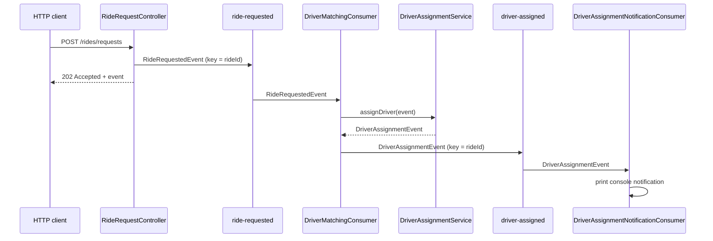

# RouteX

## Overview

RouteX is a Spring Boot learning project that models a small, event-driven ride-dispatch workflow with Apache Kafka. A passenger submits a ride request over HTTP; matching consumes that request asynchronously, selects one of the in-memory demo drivers, and publishes a driver-assignment event. A notification consumer then prints the assignment.

The business rules are intentionally small so the Kafka boundaries are easy to inspect. RouteX is not a production ride-hailing system: driver selection is random from an in-memory list and notification delivery is console output.

## Architecture

```mermaid
flowchart LR
    Client[HTTP client] -->|POST /rides/requests| Controller[RideRequestController]
    Controller -->|RideRequestedEvent\nkey: rideId| Requested[Kafka topic: ride-requested\n3 partitions]
    Requested -->|driver-matching-group| Matching[DriverMatchingConsumer]
    Matching --> Service[DriverAssignmentService]
    Service --> Producer[DriverAssignmentProducer]
    Producer -->|DriverAssignmentEvent\nkey: rideId| Assigned[Kafka topic: driver-assigned\n3 partitions]
    Assigned -->|notification-group| Notification[DriverAssignmentNotificationConsumer]
    Notification --> Console[Console notification]
```



`KafkaTopicConfiguration` declares both topics. Spring Kafka serializes event values as JSON and keys as strings; listener containers deserialize them before invoking the consumers.

## Tech Stack

- Java 21
- Spring Boot 3.5.16
- Spring Web and Bean Validation
- Spring for Apache Kafka
- Apache Kafka 7.9.0 (Confluent image)
- Kafka UI 0.7.2
- Maven
- Docker Compose

## Kafka Event Architecture

### `ride-requested`

| Detail | Current implementation |
| --- | --- |
| Purpose | Carries the fact that RouteX accepted a ride request. |
| Event | `RideRequestedEvent(rideId, passengerId, pickupLocation, destinationLocation, requestedAt)` |
| Producer | `RideRequestController` after `POST /rides/requests` validates `RideRequest` and creates a UUID ride ID. |
| Key | `event.rideId()` |
| Partitions | 3, declared by `KafkaTopicConfiguration.rideRequestedTopic()`. |
| Consumer | `DriverMatchingConsumer.handleRideRequested` |
| Consumer group | `driver-matching-group` |
| Listener concurrency | Not configured; the active listener uses Spring Kafka's default container concurrency of 1. |
| Processing | `DriverAssignmentService` chooses a demo driver, then `DriverAssignmentProducer` publishes the resulting assignment. |

### `driver-assigned`

| Detail | Current implementation |
| --- | --- |
| Purpose | Carries the fact that matching assigned a driver to a ride. |
| Event | `DriverAssignmentEvent(rideId, passengerId, driverId, driverName, vehicleNumber, assignedAt)` |
| Producer | `DriverAssignmentProducer.publish`, called by `DriverMatchingConsumer`. |
| Key | `event.rideId()` |
| Partitions | 3, declared by `KafkaTopicConfiguration.driverAssignedTopic()`. |
| Consumer | `DriverAssignmentNotificationConsumer.handleDriverAssigned` |
| Consumer group | `notification-group` |
| Listener concurrency | Not configured; the active listener uses Spring Kafka's default container concurrency of 1. |
| Processing | Prints the passenger, selected driver, vehicle, and ride ID to standard output. |

The global `spring.kafka.consumer.group-id` value is `routex-ride-request-logger`, but neither active listener uses it: both listener annotations set an explicit `groupId`.

## End-to-End Ride Flow



The controller does not call matching or notification directly. `KafkaTemplate.send(...)` is asynchronous and the controller neither waits for its result nor adds a callback. Therefore `202 Accepted` is not an end-to-end confirmation that matching or notification has completed.

## Partitioning and Ordering

Both producers use the ride ID as the Kafka key. For a keyed record, Kafka's partitioner uses the key and current topic partition metadata to choose a partition. Consequently, records with the same `rideId` sent to the same topic under an unchanged partitioning setup are consistently routed to the same partition.

This lets RouteX preserve the order of related records **within that partition**. Kafka does not provide one global order across the three partitions, and records for different rides can be processed in parallel. Increasing a topic's partition count can change the partition selected for future records with the same key; it does not move existing records. See [partitioning, keys, and ordering](docs/partitioning-keys-and-ordering.md).

## Consumer Groups and Concurrency

Within one group, each topic partition is assigned to at most one active consumer at a time. A consumer may own several partitions; extra consumers may be idle. With RouteX's three configured partitions, the maximum useful active consumer count for either topic in one group is three.

The code does not set `@KafkaListener(concurrency = "...")` or `spring.kafka.listener.concurrency`; each active listener currently has one consumer instance. `TopicBuilder.partitions(3)` creates topic parallelism, whereas listener concurrency creates Spring Kafka consumer instances—it does not create partitions. More detail: [consumer groups, concurrency, and offsets](docs/consumer-groups-concurrency-and-offsets.md).

## Observability and Delivery Scope

The matching consumer logs the ride ID, received partition, and received offset. The notification consumer prints passenger/driver/vehicle/ride details and then prints the received partition; its second line is currently labelled `MATCHING` in the source even though it is emitted by the notification consumer.

`spring.kafka.listener.ack-mode` is `manual`. Both consumers receive an `Acknowledgment` and call `acknowledge()` after their normal processing. The matching consumer deliberately throws for `passengerId` `failure-test` after publishing the assignment and before acknowledging, so it demonstrates the duplicate-side-effect risk around a failed unacknowledged record. There is no explicit retry policy, error handler, dead-letter topic, idempotency mechanism, transaction, or producer send callback. Topic, thread, and consumer-instance metadata are not logged, and no metrics or tracing infrastructure exists. See [consumer observability and delivery scope](docs/consumer-observability-and-delivery-scope.md).

## Run Locally

### Prerequisites

- Java 21
- Maven
- Docker and Docker Compose

Start Kafka and Kafka UI:

```powershell
docker compose up -d
Test-NetConnection localhost -Port 9092
```

Run RouteX:

```powershell
mvn spring-boot:run
```

Kafka is exposed to the host at `localhost:9092`; Kafka UI is available at `http://localhost:8081`. The broker is a single local KRaft node. The Compose file does not declare a Kafka data volume, so treat it as development infrastructure.

Submit a ride request:

```powershell
Invoke-RestMethod -Method Post -Uri http://localhost:8080/rides/requests -ContentType application/json -Body '{"passengerId":"passenger-42","pickupLocation":"Koramangala","destinationLocation":"Indiranagar"}'
```

The response contains the generated `rideId`. Use it to trace the event in Kafka UI and application output. Stop the local services when finished:

```powershell
docker compose down
```

## Technical Documentation

- [Kafka foundations](docs/kafka-foundations.md)
- [The `ride-requested` topic](docs/ride-requested-topic.md)
- [The `driver-assigned` topic](docs/driver-assigned-topic.md)
- [Partitioning, keys, and ordering](docs/partitioning-keys-and-ordering.md)
- [Consumer groups, concurrency, and offsets](docs/consumer-groups-concurrency-and-offsets.md)
- [Consumer observability and delivery scope](docs/consumer-observability-and-delivery-scope.md)

## Current Limitations

- Driver assignment selects randomly from three in-memory demo drivers.
- Notification is a console message, not a delivery integration.
- The local broker is single-node; topic replication is not explicitly configured in `KafkaTopicConfiguration`.
- Manual acknowledgements are implemented, but no retry, DLT, idempotency, transaction, or producer send-result handling is configured.
