# RouteX

## Overview

RouteX is a Spring Boot and Apache Kafka learning project built around a small ride-dispatch workflow. An HTTP ride request becomes a keyed Kafka event, matching assigns an in-memory demo driver, and notification consumes the resulting assignment. The project also demonstrates manual acknowledgements, retry backoff, recovery with `DeadLetterPublishingRecoverer`, and inspection of dead-letter records.

The domain is deliberately small: driver selection is random from three in-memory drivers and notification is console output. That keeps Kafka behaviour visible.

## Architecture

```mermaid
flowchart LR
    C[HTTP client] -->|POST /rides/requests| R[RideRequestController]
    R -->|RideRequestedEvent; key=rideId| RR[ride-requested; 3 partitions]
    RR -->|driver-matching-group| M[DriverMatchingConsumer]
    M -->|success| S[DriverAssignmentService]
    S --> P[DriverAssignmentProducer]
    P -->|DriverAssignmentEvent; key=rideId| DA[driver-assigned; 3 partitions]
    DA -->|notification-group| N[DriverAssignmentNotificationConsumer]
    M -->|failure-test: initial + 3 retries| EH[DefaultErrorHandler]
    EH --> RCV[DeadLetterPublishingRecoverer]
    RCV -. default destination .-> DOT[ride-requested.DLT]
    DLT[ride-requested-dlt; 3 partitions] -->|routex-dlt-monitor| DLC[DeadLetterConsumer]
```



The solid success path is active. The dotted recovery path exposes an important current configuration mismatch: `DeadLetterConsumer` listens to `ride-requested-dlt`, but `DeadLetterPublishingRecoverer` is constructed without a destination resolver and therefore uses Spring Kafka's default `ride-requested.DLT` destination. See [Dead-letter topics and recovery](docs/dead-letter-topics-and-recovery.md).

## Current Kafka Capabilities

| Area | Current implementation |
| --- | --- |
| Topics | `ride-requested`, `driver-assigned`, and declared `ride-requested-dlt` |
| Keys | Both producers use `rideId` |
| Partitions | 3 for every declared application topic |
| Consumer groups | `driver-matching-group`, `notification-group`, `routex-dlt-monitor` |
| Concurrency | No listener concurrency setting; default one consumer instance per listener |
| Observability | Matching logs ride ID, partition, and offset; DLT consumer logs record partition/offset and every header it receives |
| Acknowledgement | `spring.kafka.listener.ack-mode: manual`; active listeners acknowledge successful work |
| Retries | `FixedBackOff(2000L, 3L)` in `KafkaErrorHandlerConfiguration` |
| Recovery | `DefaultErrorHandler` with `DeadLetterPublishingRecoverer` |

## Run Locally

Prerequisites: Java 21, Maven available as `mvn`, Docker, and Docker Compose.

```powershell
docker compose up -d
mvn spring-boot:run
```

Kafka is available to RouteX at `localhost:9092`; Kafka UI is at `http://localhost:8081`.

## Quick Demo

Normal ride:

```powershell
Invoke-RestMethod -Method Post `
    -Uri "http://localhost:8080/rides/requests" `
    -ContentType "application/json" `
    -Body '{"passengerId":"passenger-101","pickupLocation":"MSRIT","destinationLocation":"Electronic City"}'
```

Expect a `202` response containing a generated ride ID, then matching and notification console lines. This demonstrates the successful event chain. Details: [ride-requested](docs/ride-requested-topic.md).

Deliberately failing ride:

```powershell
Invoke-RestMethod -Method Post `
    -Uri "http://localhost:8080/rides/requests" `
    -ContentType "application/json" `
    -Body '{"passengerId":"failure-test","pickupLocation":"MSRIT","destinationLocation":"Electronic City"}'
```

Expect the matching line once initially and three more times after roughly two-second backoffs, followed by framework recovery handling. The RouteX source currently does not route that recovered record to its declared DLT listener because of the topic-name mismatch noted above. Details: [retries and error handling](docs/kafka-retries-and-error-handling.md).

## Technical Documentation

- [Kafka foundations](docs/kafka-foundations.md)
- [The `ride-requested` topic](docs/ride-requested-topic.md)
- [The `driver-assigned` topic](docs/driver-assigned-topic.md)
- [Partitioning, message keys, and ordering](docs/partitioning-keys-and-ordering.md)
- [Consumer groups, concurrency, and offsets](docs/consumer-groups-concurrency-and-offsets.md)
- [Consumer observability](docs/consumer-observability-and-delivery-scope.md)
- [Retries and error handling](docs/kafka-retries-and-error-handling.md)
- [Dead-letter topics and recovery](docs/dead-letter-topics-and-recovery.md)
