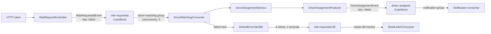
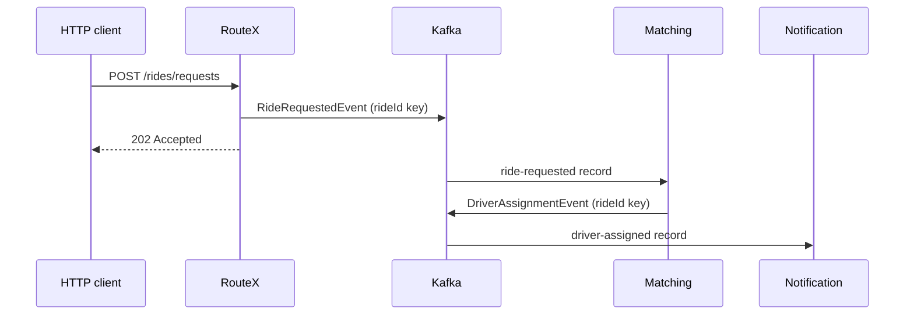

# RouteX

> Learn Apache Kafka and Spring Kafka by following one event through a production-inspired ride-dispatch workflow.

RouteX is a Java 21 / Spring Boot application that accepts ride requests over HTTP, publishes them to Kafka, assigns an in-memory demo driver, publishes an assignment event, and consumes that event for a console notification. The project deliberately keeps the business domain small so that Kafka behaviour stays visible.

## Why Kafka in a ride workflow?

In RouteX, ride intake does not call matching or notification directly. It publishes a `RideRequestedEvent` to `ride-requested`. Matching and notification are independent Kafka consumers with their own progress and failure handling. This demonstrates the event-driven boundary used when services must evolve, scale, or recover independently.

## Features

| Area | Demonstrated in RouteX |
| --- | --- |
| Event pipeline | HTTP request → `ride-requested` → matching → `driver-assigned` → notification |
| Topics and keys | Three application topics; records keyed by `rideId` |
| Parallel consumption | Three matching listener containers for three input partitions |
| Delivery control | Manual acknowledgement after successful listener work |
| Reliability | Fixed retry backoff and explicit dead-letter-topic recovery |
| Operations | Local KRaft Kafka, Kafka UI, rebalance logging, and Actuator endpoints |

## Architecture



## Event Flow



## Tech Stack

Java 21 · Spring Boot 3.5.16 · Spring for Apache Kafka · Confluent Platform 7.9.0 · Docker Compose · Kafka UI · Maven

## Quick Start

```powershell
docker compose up -d
mvn spring-boot:run
```

Kafka is exposed at `localhost:9092`; Kafka UI is at `http://localhost:8081`.

## API Summary

| Method | Endpoint | Description |
| --- | --- | --- |
| `POST` | `/rides/requests` | Creates and publishes one ride request |
| `POST` | `/rides/bulk/{count}` | Publishes generated ride requests and waits for send futures |

```powershell
Invoke-RestMethod -Method Post `
  -Uri "http://localhost:8080/rides/requests" `
  -ContentType "application/json" `
  -Body '{"passengerId":"passenger-101","pickupLocation":"MSRIT","destinationLocation":"Electronic City"}'
```

## Learning Roadmap

1. [Start and observe your first event](docs/01-getting-started/README.md)
2. [Understand the system architecture](docs/02-system-architecture/architecture.md)
3. [Learn Kafka through RouteX](docs/04-kafka-fundamentals/kafka-through-routex.md)
4. [Follow producers, consumers, partitions, groups, offsets, retries, and DLT recovery](docs/05-producers/ride-request-producer.md)
5. [Compare RouteX with production systems](docs/19-production-guide/production-gaps-and-evolution.md)
6. [Revise with the interview guide and cheat sheet](docs/20-interview-guide/kafka-through-routex-interviews.md)

## Documentation Index

| Path | Focus |
| --- | --- |
| [01 Getting started](docs/01-getting-started/README.md) | Local setup and first observation |
| [02 System architecture](docs/02-system-architecture/architecture.md) | Components, packages, and event flow |
| [03 Event-driven architecture](docs/03-event-driven-architecture/decoupling-with-events.md) | Why RouteX uses events |
| [04 Kafka fundamentals](docs/04-kafka-fundamentals/kafka-through-routex.md) | Kafka concepts mapped to the code |
| [05–06 Producers and consumers](docs/05-producers/ride-request-producer.md) | Client and listener behaviour |
| [07–14 Topic to DLT](docs/07-topics/topic-provisioning.md) | Topology, ordering, groups, offsets, acknowledgements, retries |
| [15–16 Operations](docs/15-producer-performance/batching-compression-and-acks.md) | Producer tuning and observability |
| [17–22 Reference and revision](docs/17-api-reference/ride-api.md) | API, production, interview, cheat sheet, FAQ |

## Contributing

Contributions should preserve the learning-first approach: tie claims to executable source, use RouteX before general theory, and distinguish production guidance from current implementation.

## License

No license file is currently present. Add one before treating the repository as openly reusable.
