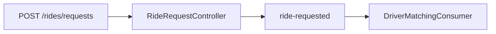

# Start with One RouteX Event

## Overview

RouteX teaches Kafka through one ride request. The request becomes a `RideRequestedEvent`, is stored in `ride-requested`, and is delivered to matching.

## Why this exists

It makes the boundary between accepting an HTTP request and processing an event visible.

## Problem it solves

Readers can observe a producer, topic, consumer group, partition, and offset in one local flow.

## RouteX implementation

`RideRequestController` creates a UUID `rideId` and publishes to `ride-requested`; `DriverMatchingConsumer` consumes in `driver-matching-group`.

## Code walkthrough

Read `src/main/java/com/routex/dispatch/RideRequestController.java`, `KafkaTopicConfiguration.java`, then `matching/DriverMatchingConsumer.java`.

## Execution flow



## Kafka internals

The producer appends to one partition. Kafka assigns an offset; the group tracks progress for that partition.

## Spring Boot internals

Boot binds `application.yaml`, creates Kafka client infrastructure, and Spring Kafka runs `@KafkaListener` methods in listener containers.

## Observe this in RouteX

```powershell
docker compose up -d
mvn spring-boot:run
Invoke-RestMethod -Method Post -Uri http://localhost:8080/rides/requests -ContentType application/json -Body '{"passengerId":"passenger-101","pickupLocation":"MSRIT","destinationLocation":"Electronic City"}'
```

Inspect `ride-requested` and `driver-matching-group` in Kafka UI (`http://localhost:8081`). A delivered record produces a `MATCHING` log with its partition, offset, and thread.

## Production implementation

| RouteX | Production |
| --- | --- |
| Local broker | Replicated multi-broker cluster |
| Console output | Central logs, metrics, and tracing |
| In-memory drivers | Durable availability service |

## Trade-offs

Kafka decouples stages and retains records, but makes end-to-end completion asynchronous.

## Common mistakes

- Treating `202 Accepted` as matching completion.
- Treating offsets as globally unique across partitions.

## Best practices

Use a stable correlation key and inspect topic records and group progress while learning.

## Interview questions

**Why does RouteX return before matching?** Publication and later consumption are independent operations.

**Follow-up:** What identifies a consumed record? Its topic, partition, and offset.

**Enterprise discussion:** APIs should expose asynchronous status when callers need completion semantics.

## Quick revision

HTTP request → `RideRequestedEvent` → `ride-requested` → partition/offset → matching group.

