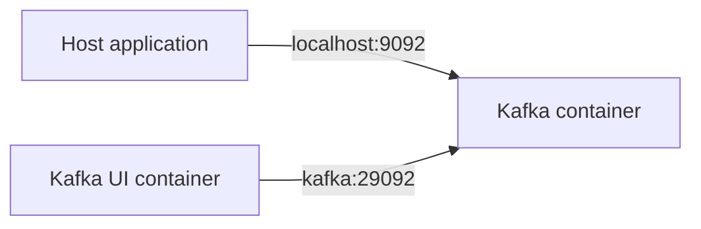

# Local RouteX Environment

## Overview

RouteX runs Kafka and Kafka UI in Docker; the Spring Boot application runs on the host.

## Why this exists

Kafka clients need listener addresses reachable from their own network.

## Problem it solves

It distinguishes host access from Docker-network access.

## RouteX implementation

`compose.yaml` exposes Kafka at `localhost:9092` and supplies Kafka UI with `kafka:29092`. `application.yaml` uses `localhost:9092`.

## Code walkthrough

Read `compose.yaml` alongside `src/main/resources/application.yaml`.

## Execution flow



## Kafka internals

The local node combines KRaft broker and controller roles; it is a development topology.

## Spring Boot internals

`spring.kafka.bootstrap-servers` provides the initial broker address used for client discovery.

## Observe this in RouteX

```powershell
docker compose up -d
docker compose ps
docker compose logs kafka
```

Open `http://localhost:8081` and verify Kafka UI can load the cluster.

## Production implementation

| RouteX | Production |
| --- | --- |
| Single combined node | Separate, fault-tolerant controller/broker deployment |
| PLAINTEXT | TLS, authentication, and authorization |
| Docker Compose | Managed service or orchestration platform |

## Trade-offs

One node is easy to use but has no broker fault tolerance.

## Common mistakes

- Using `kafka:29092` from a host JVM.
- Advertising an address client networks cannot reach.

## Best practices

Validate advertised listeners from every client network.

## Interview questions

**Why two listeners?** Host and Docker clients require different reachable addresses.

**Follow-up:** What happens with an invalid advertised address? Discovery succeeds but subsequent connections fail.

**Enterprise discussion:** Listener design is a network and security decision.

## Quick revision

Host RouteX uses `localhost:9092`; Docker Kafka UI uses `kafka:29092`.
