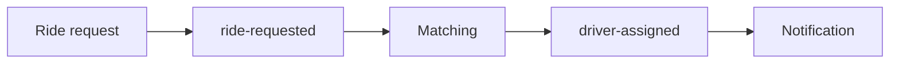

# RouteX System Architecture

## Overview

RouteX separates ride intake, matching, and notification with Kafka topics.

## Why this exists

The architecture shows why an event pipeline is different from direct service calls.

## Problem it solves

Matching can consume persisted ride requests independently of HTTP intake; notification consumes assignments independently of matching.

## RouteX implementation

`RideRequestController` publishes `ride-requested`; `DriverMatchingConsumer` publishes `driver-assigned`; `DriverAssignmentNotificationConsumer` consumes it.

## Code walkthrough

Follow `dispatch/RideRequestController.java` → `matching/DriverMatchingConsumer.java` → `matching/DriverAssignmentProducer.java` → `notification/DriverAssignmentNotificationConsumer.java`.

## Execution flow

## Kafka internals

Topics retain records; separate consumer groups hold separate committed positions.

## Spring Boot internals

`KafkaTemplate` produces records and listener containers invoke annotated methods.

## Observe this in RouteX

Send a normal request, then view both topics in Kafka UI and correlate console lines by `rideId`.

## Production implementation

| RouteX | Production |
| --- | --- |
| One application process | Independently deployed services |
| Random drivers | Availability, dispatch, and persistence services |

## Trade-offs

Decoupling improves independent recovery but makes cross-stage completion eventually consistent.

## Common mistakes

- Calling topic consumption synchronous RPC.
- Assuming topic order spans both topics.

## Best practices

Use business correlation IDs across event contracts.

## Interview questions

**What does Kafka decouple here?** Producer availability and timing from consumer processing.

**Follow-up:** Can notification read `ride-requested` directly? Yes, but RouteX chooses an assignment event as its contract.

**Enterprise discussion:** Event contracts should represent business facts, not internal method calls.

## Quick revision

Two topics create two durable boundaries: intake→matching and matching→notification.

