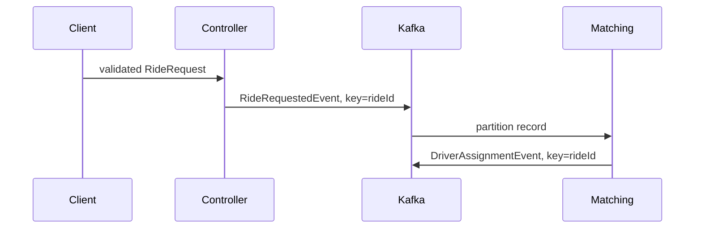

# RouteX Record Journey

## Overview

This page follows one `rideId` through RouteX.

## Why this exists

Kafka is easier to learn by following a record than by memorizing component names.

## Problem it solves

It connects HTTP validation, event creation, partitioning, listener handling, and acknowledgement.

## RouteX implementation

`RideRequest` is validated, converted to `RideRequestedEvent`, then later converted to `DriverAssignmentEvent`.

## Code walkthrough

The records are in `dispatch/RideRequest.java`, `RideRequestedEvent.java`, and `matching/DriverAssignmentEvent.java`.

## Execution flow

## Kafka internals

Each produced event becomes a record with a topic, partition, key, value, headers, and offset.

## Spring Boot internals

Spring's JSON serializer writes the records; listener conversion supplies typed record values to methods.

## Observe this in RouteX

Use a normal request and compare its `rideId` in the HTTP response, `MATCHING`, `PRODUCER ACK`, and `NOTIFICATION` logs.

## Production implementation

| RouteX | Production |
| --- | --- |
| Generated UUID | Domain-wide correlation and idempotency strategy |
| Console correlation | Searchable traces and structured log fields |

## Trade-offs

Events preserve history but require consumers to handle duplicate delivery and delayed processing.

## Common mistakes

- Reusing a mutable request object as an event contract.
- Losing the correlation key in downstream events.

## Best practices

Carry the business identifier needed to correlate downstream facts.

## Interview questions

**Why publish a second event?** Assignment is a new business fact for independent consumers.

**Follow-up:** Is cross-topic partition number guaranteed? No.

**Enterprise discussion:** Event schemas should evolve compatibly.

## Quick revision

`RideRequest` is input; `RideRequestedEvent` and `DriverAssignmentEvent` are Kafka facts.

