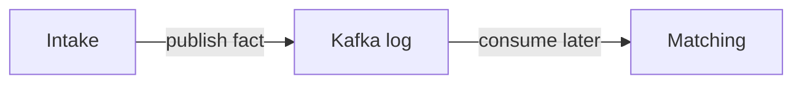

# Decoupling RouteX with Events

## Overview

RouteX publishes ride requests instead of invoking matching from its controller.

## Why this exists

It demonstrates temporal decoupling: intake can finish before matching is available to process.

## Problem it solves

Kafka provides a retained handoff between stages.

## RouteX implementation

`RideRequestController` depends on `KafkaTemplate`, not on `DriverAssignmentService` or notification code.

## Code walkthrough

Compare `dispatch/RideRequestController.java` with `matching/DriverMatchingConsumer.java`.

## Execution flow

## Kafka internals

Kafka stores records until retention policies remove them; consumers advance independently by group.

## Spring Boot internals

The controller uses `KafkaTemplate`; the listener container polls Kafka in background consumer threads.

## Observe this in RouteX

Observe that the controller returns `202` while matching output occurs asynchronously.

## Production implementation

| RouteX | Production |
| --- | --- |
| Single codebase | Separate deployable bounded contexts |
| No persistence | Outbox/idempotency design around source-of-truth writes |

## Trade-offs

Loose coupling improves resilience but requires explicit consistency and replay decisions.

## Common mistakes

- Assuming an event means every consumer completed.
- Embedding consumer-specific behavior in the producer.

## Best practices

Publish durable business facts and let consumers own their reactions.

## Interview questions

**What is temporal decoupling?** Producers and consumers need not be online at the same instant.

**Follow-up:** What is the cost? Eventual consistency and operational ownership.

**Enterprise discussion:** Use events where independent evolution outweighs synchronous simplicity.

## Quick revision

RouteX intake publishes a fact; matching and notification react later through Kafka.

