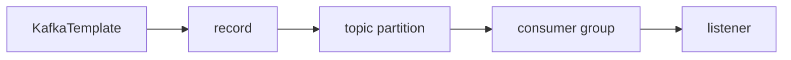

# Kafka Fundamentals Through RouteX

## Overview

RouteX maps core Kafka nouns to real code: broker, topic, partition, record, producer, consumer, group, key, and offset.

## Why this exists

Definitions are memorable when attached to `ride-requested` and `rideId`.

## Problem it solves

It prevents confusing Spring abstractions with Kafka's stored-record model.

## RouteX implementation

`KafkaTopicConfiguration` declares topics; `KafkaTemplate` produces; `@KafkaListener` consumes; `rideId` is the key.

## Code walkthrough

Read `dispatch/KafkaTopicConfiguration.java`, `RideRequestController.java`, and the three listener classes.

## Execution flow

## Kafka internals

A broker stores ordered partition logs. An offset identifies one position in one partition; a group commits its own progress.

## Spring Boot internals

Boot supplies client properties; Spring Kafka adapts records to typed listener method arguments.

## Observe this in RouteX

Inspect a `ride-requested` partition in Kafka UI and compare its offset with the `MATCHING` log.

## Production implementation

| RouteX | Production |
| --- | --- |
| Three local partitions | Partition count sized for expected parallelism |
| JSON Java records | Versioned contracts and compatibility governance |

## Trade-offs

More partitions allow more parallel consumers but raise metadata, ordering, and operational cost.

## Common mistakes

- Calling a topic a queue with one global reader.
- Assuming a record's offset identifies it across all partitions.

## Best practices

Choose keys around the ordering unit and groups around independent business responsibilities.

## Interview questions

**What is a Kafka record in RouteX?** A keyed event stored in a topic partition.

**Follow-up:** What tracks consumption? A group offset per topic partition.

**Enterprise discussion:** Topic design is a long-lived contract decision.

## Quick revision

Producer writes records; broker stores partitions; group consumers read and commit partition progress.
