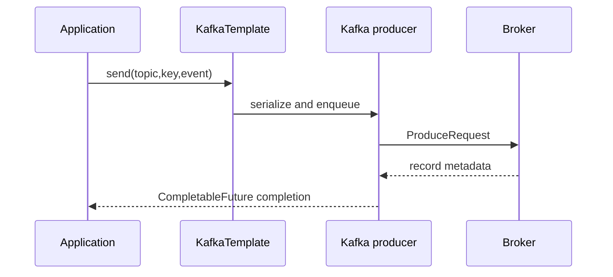

# Producers Through the RouteX Request Flow

## Overview

RouteX has two producer call sites: the HTTP controller publishes ride requests and matching publishes assignments.

## Why this exists

It connects a business event to the Kafka client rather than treating producer settings as abstract flags.

## Problem it solves

It shows how a key, serializer, asynchronous future, and broker acknowledgement relate to a send.

## RouteX implementation

`RideRequestController` and `DriverAssignmentProducer` call `KafkaTemplate.send(topic, event.rideId(), event)` and attach completion callbacks.

## Code walkthrough

Read `dispatch/RideRequestController.java` and `matching/DriverAssignmentProducer.java`.

## Execution flow

## Kafka internals

The client serializes key/value bytes, selects a partition, batches records, sends produce requests, and completes futures with broker metadata.

## Spring Boot internals

Boot configures the producer factory from `spring.kafka.producer`; `KafkaTemplate` delegates sends to a producer.

## Observe this in RouteX

Watch `PRODUCER ACK` output for topic, partition, offset, and key after a send completes.

## Production implementation

| RouteX | Production |
| --- | --- |
| Console future callbacks | Structured failures, metrics, and delivery policy |
| JSON events | Governed schemas and compatibility rules |

## Trade-offs

Async sends improve throughput but require callers to decide when completion matters.

## Common mistakes

- Ignoring send-future failures.
- Sending without a key when per-ride order matters.

## Best practices

Make delivery semantics and failure handling explicit at each producer boundary.

## Interview questions

**Why use `rideId` as a key?** It selects a consistent partition for that key within a topic.

**Follow-up:** When is a send complete? When its future completes with metadata or failure.

**Enterprise discussion:** Producer idempotency does not solve business-level duplicate handling by itself.

## Quick revision

RouteX producers send keyed JSON events and log broker metadata on future completion.

