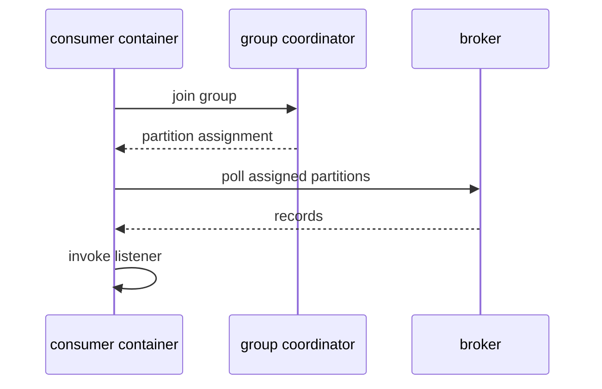

# Consumer Lifecycle in RouteX

## Overview

RouteX listener methods are invoked only after Kafka assigns partitions to their consumer-group members.

## Why this exists

It explains why a listener is not a direct callback from the producer.

## Problem it solves

It connects startup, group join, partition assignment, polling, listener invocation, acknowledgement, and rebalancing.

## RouteX implementation

`KafkaConsumerConfiguration` creates the matching listener factory and installs `KafkaRebalanceListener`; matching uses three containers through `concurrency = "3"`.

## Code walkthrough

Read `config/KafkaConsumerConfiguration.java`, `reliability/KafkaRebalanceListener.java`, and `matching/DriverMatchingConsumer.java`.

## Execution flow

## Kafka internals

The group coordinator manages membership and assignments. During a rebalance, partitions can be revoked before reassignment.

## Spring Boot internals

Spring Kafka owns polling threads and method invocation; `ConsumerRebalanceListener` receives assignment callbacks through the configured container factory.

## Observe this in RouteX

Start the application and watch `REBALANCE | ASSIGNED` lines for matching. Stop/start the application and observe revoke/assign activity.

## Production implementation

| RouteX | Production |
| --- | --- |
| Console rebalance callbacks | Deployment-aware rebalance metrics and safe shutdown |
| Short demo listener work | Bounded processing with timeout and poll-interval design |

## Trade-offs

More consumer members improve parallelism but can make rebalances more frequent and disruptive.

## Common mistakes

- Running slow work on the consumer thread without considering poll intervals.
- Assuming a listener owns a fixed partition forever.

## Best practices

Keep poll-thread work bounded, handle revocation safely, and monitor assignment and lag changes.

## Interview questions

**What triggers a rebalance?** Group membership or subscription/partition changes, among other coordinator events.

**Follow-up:** What happens to a revoked partition? Its ownership moves only after group coordination assigns it.

**Enterprise discussion:** Rebalance-safe work is essential for predictable consumer deployments.

## Quick revision

Container joins group → receives partitions → polls → invokes listener; rebalances revoke and reassign ownership.
