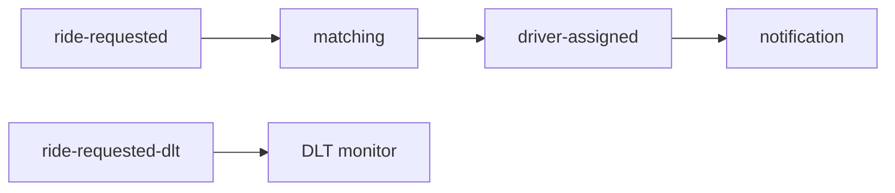

# RouteX Consumers

## Overview

Matching consumes `ride-requested`; notification consumes `driver-assigned`; the DLT monitor consumes recovered requests.

## Why this exists

It shows that consumers react to stored facts, not direct producer calls.

## Problem it solves

Each business responsibility gets a group and a listener method.

## RouteX implementation

`DriverMatchingConsumer`, `DriverAssignmentNotificationConsumer`, and `DeadLetterConsumer` are the three active consumers.

## Code walkthrough

Read each `@KafkaListener` declaration and its acknowledgement call.

## Execution flow

## Kafka internals

Consumers poll assigned partitions; group membership determines which instance receives each partition.

## Spring Boot internals

Spring Kafka converts records, invokes listener methods, and delegates errors to the configured error handler.

## Observe this in RouteX

Use a normal request and observe matching then notification output. Use `failure-test` to observe only matching retries and later DLT output.

## Production implementation

| RouteX | Production |
| --- | --- |
| Console notification | External notification integration with idempotency |
| Random driver assignment | Durable dispatch workflow and data ownership |

## Trade-offs

Consumer isolation permits independent scaling but adds event contracts and asynchronous failure handling.

## Common mistakes

- Performing irreversible side effects before retry boundaries are understood.
- Sharing one group for unrelated responsibilities.

## Best practices

Keep listener work idempotent and make downstream publish/ack order deliberate.

## Interview questions

**Why separate matching and notification topics?** Assignment is a distinct event contract and processing boundary.

**Follow-up:** What happens if notification is down? Its group falls behind while matching can continue.

**Enterprise discussion:** Consumers need ownership, replay, and side-effect strategies.

## Quick revision

Matching creates assignments; notification reacts; DLT monitoring observes exhausted failures.

