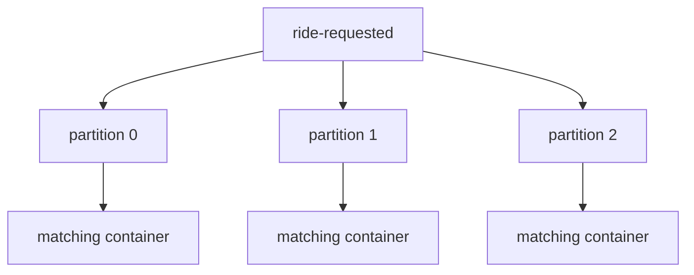

# Partitions in RouteX

## Overview

Each RouteX application topic is declared with three partitions.

## Why this exists

Partitions allow matching work to be distributed while retaining order inside each partition.

## Problem it solves

Three matching containers can be active for the three partitions of `ride-requested`.

## RouteX implementation

`KafkaTopicConfiguration` calls `.partitions(3)`; `DriverMatchingConsumer` sets `concurrency = "3"`.

## Code walkthrough

Read `dispatch/KafkaTopicConfiguration.java` and the `@KafkaListener` annotation in `matching/DriverMatchingConsumer.java`.

## Execution flow

## Kafka internals

Partitions are independent ordered logs. A partition is assigned to at most one active consumer in one group.

## Spring Boot internals

Spring Kafka creates up to three consumer containers for this listener; Kafka's group coordinator assigns partitions.

## Observe this in RouteX

Send multiple requests and inspect partition fields in matching logs and group assignments in Kafka UI.

## Production implementation

| RouteX | Production |
| --- | --- |
| Fixed three partitions | Capacity-based partition count with growth strategy |
| Matching concurrency equals partitions | Concurrency sized for workload, CPU, and downstream limits |

## Trade-offs

More partitions increase parallelism but do not provide global order and add rebalancing/metadata cost.

## Common mistakes

- Expecting a fourth matching container to process when only three partitions exist.
- Confusing partition count with replication factor.

## Best practices

Choose partitions from expected throughput and maximum useful consumer parallelism.

## Interview questions

**Why three matching containers?** RouteX has three input partitions, allowing up to three active group consumers.

**Follow-up:** Can one consumer own multiple partitions? Yes.

**Enterprise discussion:** Partition changes affect key mapping for future records.

## Quick revision

Partitions provide RouteX parallelism; one group consumer owns a partition at a time.

