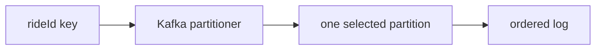

# Ordering by `rideId`

## Overview

RouteX sends both event types with `rideId` as their Kafka key.

## Why this exists

The key defines the unit whose records should select the same partition within a topic.

## Problem it solves

Multiple records for one ride can preserve partition-local order when produced to the same topic with the same key.

## RouteX implementation

`RideRequestController` and `DriverAssignmentProducer` call `KafkaTemplate.send(topic, event.rideId(), event)`.

## Code walkthrough

Read both producer call sites in `dispatch/RideRequestController.java` and `matching/DriverAssignmentProducer.java`.

## Execution flow

## Kafka internals

Kafka's partitioner uses key bytes and partition metadata. Kafka guarantees record order within a partition, not across partitions or topics.

## Spring Boot internals

The configured `StringSerializer` serializes the key before the Kafka client chooses a partition.

## Observe this in RouteX

The public request endpoint creates a new UUID per request. Compare key-related event IDs and partition logs; use source reading to understand the same-key rule.

## Production implementation

| RouteX | Production |
| --- | --- |
| `rideId` key | Aggregate/entity key chosen from ordering needs |
| Two topic contracts | Explicit cross-topic correlation, not cross-topic order |

## Trade-offs

A highly popular key can concentrate traffic on one partition.

## Common mistakes

- Claiming Kafka guarantees global order.
- Assuming the same key maps to the same partition number in different topics.

## Best practices

Choose a key that matches the business aggregate whose order matters.

## Interview questions

**What ordering does RouteX get?** Partition-local order for records sharing a selected partition.

**Follow-up:** Does order span `ride-requested` and `driver-assigned`? No.

**Enterprise discussion:** Key skew must be measured before scaling partitions.

## Quick revision

`rideId` is the key; Kafka orders records inside, never across, partitions.

