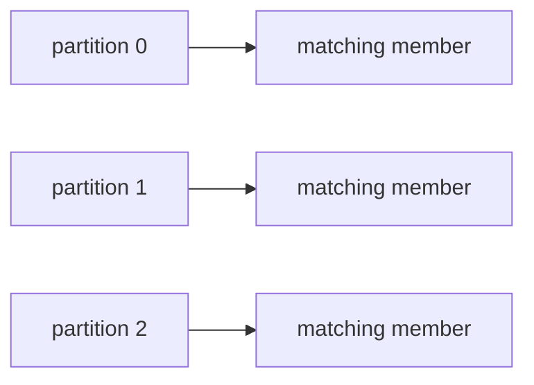

# Consumer Groups and Concurrency

## Overview

RouteX uses `driver-matching-group`, `notification-group`, and `routex-dlt-monitor` for independent consumption.

## Why this exists

Groups define which consumers share work and which consumers receive their own copy of topic progress.

## Problem it solves

Matching can scale across partitions without making notification share matching offsets.

## RouteX implementation

Matching has explicit concurrency `3`; notification and DLT listeners have no explicit concurrency setting. The global YAML group is overridden by every active listener's `groupId`.

## Code walkthrough

Read all `@KafkaListener` annotations and `application.yaml` consumer settings.

## Execution flow

## Kafka internals

The coordinator assigns each partition to one member within a group. Different groups maintain independent offsets.

## Spring Boot internals

`concurrency = "3"` creates three listener containers for matching; the custom factory attaches the rebalance listener.

## Observe this in RouteX

Watch `REBALANCE` logs at startup and inspect matching-group assignments in Kafka UI.

## Production implementation

| RouteX | Production |
| --- | --- |
| One application instance | Multiple instances plus controlled listener concurrency |
| Console rebalance logs | Alerting and deployment-aware rebalance management |

## Trade-offs

More members improve parallelism only up to partition count and can increase rebalance disruption.

## Common mistakes

- Treating `spring.kafka.consumer.group-id` as overriding listener-level groups.
- Adding consumers beyond partitions and expecting more active work.

## Best practices

Define groups by independent business responsibility and size concurrency against partitions.

## Interview questions

**Why are notification and matching separate groups?** They must consume independently.

**Follow-up:** What occurs with five matching members? At most three can own RouteX's three partitions.

**Enterprise discussion:** Rebalances must be considered during deployments and long processing.

## Quick revision

Group = shared work/progress; matching has three members; other RouteX groups are independent.

