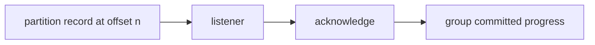

# Offsets and Delivery Progress

## Overview

RouteX logs partition and offset in matching and notification consumers so a delivered record can be located.

## Why this exists

Offsets explain what a consumer group has processed and what it will resume from.

## Problem it solves

They distinguish the record's position from the group's saved progress.

## RouteX implementation

`KafkaHeaders.RECEIVED_PARTITION` and `KafkaHeaders.OFFSET` are injected into listener methods.

## Code walkthrough

Read `DriverMatchingConsumer.handleRideRequested` and `DriverAssignmentNotificationConsumer.handleDriverAssigned`.

## Execution flow

## Kafka internals

Offsets are monotonically increasing per partition. A committed group offset is the next position the group resumes from.

## Spring Boot internals

Spring maps consumer-record metadata to `KafkaHeaders`; acknowledgement behavior is configured through listener container properties.

## Observe this in RouteX

Send requests and compare `MATCHING` partition/offset pairs with Kafka UI consumer-group lag and offsets.

## Production implementation

| RouteX | Production |
| --- | --- |
| Console metadata | Lag dashboards, alerts, tracing correlation |
| Manual acknowledgement | Explicit idempotency and failure policy around external effects |

## Trade-offs

Manual progress control is precise but places responsibility on listener code.

## Common mistakes

- Comparing offsets from different partitions as one sequence.
- Assuming acknowledgement removes a record from Kafka.

## Best practices

Monitor lag by group and partition; design consumers for redelivery.

## Interview questions

**What does offset 12 mean?** The thirteenth position in one partition, not globally.

**Follow-up:** What is a group commit? Persisted consumption progress for a topic partition.

**Enterprise discussion:** Lag is a service-level capacity and freshness signal.

## Quick revision

Offsets locate records per partition; groups commit their own resume position.
