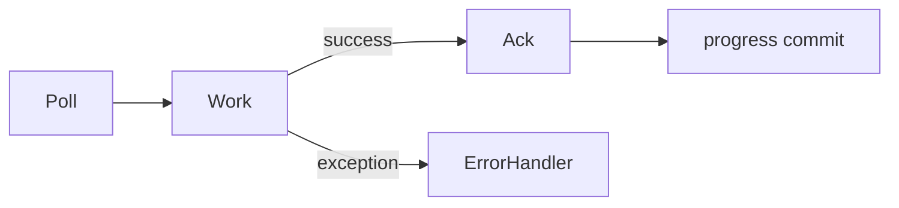

# Manual Acknowledgement Boundaries

## Overview

RouteX sets `spring.kafka.listener.ack-mode: manual` and explicitly acknowledges successful listener paths.

## Why this exists

It makes the code's declared success boundary visible.

## Problem it solves

The listener controls when it asks the container to advance processing progress.

## RouteX implementation

Matching publishes `driver-assigned` before acknowledging; notification and DLT monitor acknowledge after their console work.

## Code walkthrough

Find `Acknowledgment acknowledgment` and `acknowledgment.acknowledge()` in all consumer classes.

## Execution flow

## Kafka internals

The group stores progress per partition; records remain in Kafka after a group advances.

## Spring Boot internals

The listener container supplies `Acknowledgment` because manual acknowledgement mode is configured.

## Observe this in RouteX

Send `failure-test`: matching throws before acknowledgement, so the error handler controls redelivery and recovery.

## Production implementation

| RouteX | Production |
| --- | --- |
| Console and Kafka publish work | Explicit idempotency around databases and external services |
| Manual acknowledgement | Carefully tested commit/side-effect boundary |

## Trade-offs

Manual mode gives control but does not make arbitrary multi-system side effects atomic.

## Common mistakes

- Acknowledging before required work finishes.
- Assuming acknowledgement deletes the record.

## Best practices

Design work to tolerate redelivery and acknowledge after the required local success boundary.

## Interview questions

**Why does failure-test not acknowledge?** It throws before reaching the acknowledgement line.

**Follow-up:** Does manual ack alone guarantee exactly once? No.

**Enterprise discussion:** Combine idempotency, durable side-effect design, and observable retries.

## Quick revision

Manual ack defines listener success; it advances group progress, not Kafka record deletion.
