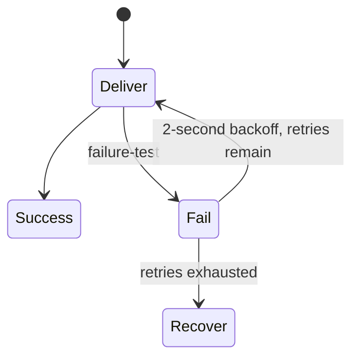

# Retries and Error Handling

## Overview

RouteX deliberately throws for `passengerId="failure-test"` before downstream assignment work.

## Why this exists

It gives one deterministic record failure for learning listener redelivery.

## Problem it solves

`DefaultErrorHandler` keeps retry policy outside business logic.

## RouteX implementation

`KafkaErrorHandlerConfiguration` creates `FixedBackOff(2000L, 3L)`: initial delivery plus three retry attempts.

## Code walkthrough

Read the failure branch in `matching/DriverMatchingConsumer.java` and `config/KafkaErrorHandlerConfiguration.java`.

## Execution flow



## Kafka internals

The same unprocessed source record is redelivered; its partition and offset remain the same during retries.

## Spring Boot internals

The listener container delegates thrown exceptions to the `DefaultErrorHandler` bean configured by Boot's listener-factory configuration.

## Observe this in RouteX

```powershell
Invoke-RestMethod -Method Post -Uri http://localhost:8080/rides/requests -ContentType application/json -Body '{"passengerId":"failure-test","pickupLocation":"MSRIT","destinationLocation":"Electronic City"}'
```

Observe four matching attempts approximately two seconds apart; no assignment notification is expected from this branch.

## Production implementation

| RouteX | Production |
| --- | --- |
| Fixed retry for all failures | Exception-aware retry policy and downstream timeout strategy |
| Demo failure before side effect | Idempotent handling of failures around real side effects |

## Trade-offs

Blocking retries are simple but hold the consumer partition and can delay later records.

## Common mistakes

- Calling three retries four retries; RouteX has one initial attempt plus three retries.
- Retrying non-transient errors indefinitely.

## Best practices

Classify failures, bound retries, and ensure retry attempts can safely repeat work.

## Interview questions

**How many matching attempts occur?** Up to four.

**Follow-up:** Why the same offset? It is redelivery of the same partition record.

**Enterprise discussion:** Retry policy must balance recovery probability, ordering, and consumer throughput.

## Quick revision

`failure-test` → exception → 2s backoff × 3 → recovery; source work happens before no assignment publish.

