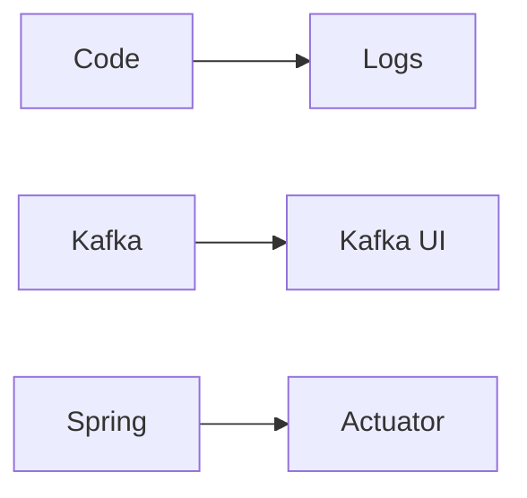

# Observability in RouteX

## Overview

RouteX exposes Kafka behavior through console logs, Kafka UI, Actuator endpoints, and selected Kafka client loggers.

## Why this exists

Kafka learning requires seeing records, partitions, assignments, and failures rather than trusting code alone.

## Problem it solves

It links application signals to Kafka state.

## RouteX implementation

Matching logs ride/partition/offset/thread; notification logs event context; DLT logs headers; rebalance callbacks log assignments. Actuator exposes `health`, `info`, `metrics`, `prometheus`, `env`, `configprops`, and `beans`.

## Code walkthrough

Read listener classes, `KafkaRebalanceListener.java`, and `application.yaml` logging/management sections.

## Execution flow

## Kafka internals

Topic records, partition offsets, group assignments, and lag are broker/client state that UI can expose.

## Spring Boot internals

Actuator endpoint exposure is configured under `management.endpoints.web.exposure.include`; logger levels are configured under `logging.level`.

## Observe this in RouteX

Open `/actuator/health`, `/actuator/metrics`, and Kafka UI. Treat `/actuator/env`, `/configprops`, and `/beans` as local diagnostic endpoints because they expose configuration/application details.

## Production implementation

| RouteX | Production |
| --- | --- |
| Console output | Structured, centralized logs |
| Broad local Actuator exposure | Restricted, authenticated management surface |
| Kafka UI inspection | Metrics, dashboards, alerts, and audit controls |

## Trade-offs

Detailed client logging helps diagnosis but can be noisy and expensive.

## Common mistakes

- Exposing environment/configuration endpoints publicly.
- Treating logs as a replacement for lag metrics.

## Best practices

Use structured correlation fields and protect management endpoints.

## Interview questions

**What can Kafka UI show here?** Topics, partitions, records, consumer groups, and offsets.

**Follow-up:** Why limit debug logs in production? Volume and potential sensitive detail.

**Enterprise discussion:** Observability must cover both application work and Kafka client/broker health.

## Quick revision

RouteX observes via console, Kafka UI, Actuator, and targeted Kafka DEBUG/TRACE logs.
