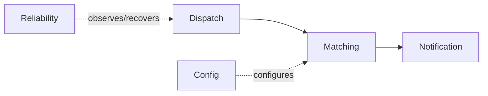

# RouteX Package Responsibilities

## Overview

RouteX separates dispatch, matching, notification, configuration, reliability, and response concerns.

## Why this exists

Kafka examples become harder to learn when topology, business logic, and failure policy are mixed together.

## Problem it solves

The package map tells readers where each event-stage responsibility lives.

## RouteX implementation

`dispatch` owns intake/topics; `matching` owns assignment; `notification` owns output; `reliability` owns DLT/rebalance observation; `config` owns container/error setup.

## Code walkthrough

Start at `RouteXApplication.java`, then navigate by package in the order above.

## Execution flow

## Kafka internals

Package boundaries do not create Kafka boundaries; topic records and group assignments do.

## Spring Boot internals

Component scanning finds `@Component`, `@Service`, `@Configuration`, and controller classes under `com.routex`.

## Observe this in RouteX

Use IDE navigation from a `rideId` log line to the class responsible for emitting it.

## Production implementation

| RouteX | Production |
| --- | --- |
| Packages in one application | Modules/services with explicit ownership boundaries |
| Shared application configuration | Environment-specific configuration and platform policies |

## Trade-offs

One codebase simplifies learning; independent services increase isolation but require contract governance.

## Common mistakes

- Equating Java packages with deployable service boundaries.
- Putting retry policy inside every business listener.

## Best practices

Keep event contracts, topology, business handling, and reliability concerns discoverable.

## Interview questions

**Why is retry configuration separate?** Failure policy is cross-cutting, not matching business logic.

**Follow-up:** What discovers these classes? Spring component scanning.

**Enterprise discussion:** Code structure should make ownership and failure boundaries clear.

## Quick revision

Dispatch publishes; matching assigns; notification reacts; config wires; reliability recovers/observes.

