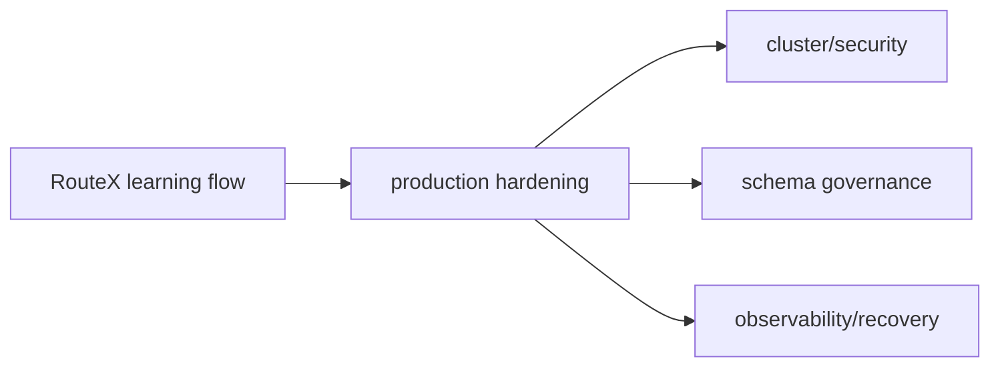

# RouteX to Production Evolution

## Overview

RouteX is a learning implementation; production systems need capabilities that are not present in its source.

## Why this exists

It prevents readers from copying a local demo topology as an enterprise blueprint.

## Problem it solves

It distinguishes verified RouteX behavior from production guidance.

## RouteX implementation

The repository has one local broker, JSON events, console output, in-memory driver selection, and no test sources.

## Code walkthrough

Compare `compose.yaml`, `application.yaml`, `DriverAssignmentService.java`, and the absence of test classes.

## Execution flow

## Kafka internals

Replication, ISR, retention, ACLs, quotas, and broker capacity are cluster-level concerns not implemented by the local demo.

## Spring Boot internals

Boot configuration externalization supports environments, but RouteX contains only its current local configuration.

## Observe this in RouteX

Inspect `compose.yaml` and source: no TLS/SASL, database, schema registry dependency, or tests are present.

## Production implementation

| RouteX | Production |
| --- | --- |
| Single local KRaft node | Multi-node resilient Kafka cluster |
| JSON serializer | Versioned contracts and schema governance |
| No persistence | Transactional/outbox and idempotency strategy where needed |
| Console logs | Central logs, metrics, traces, alerts |
| No authentication | TLS, SASL/OAuth, ACL/RBAC policy |

## Trade-offs

Production safeguards add cost and operational discipline, but reduce data-loss and integration risk.

## Common mistakes

- Calling local Compose a production design.
- Adding reliability claims not demonstrated by source.

## Best practices

Evolve topology, security, observability, contracts, tests, and failure ownership together.

## Interview questions

**What is the largest RouteX production gap?** It depends on the requirement; durability, security, contract governance, and side-effect handling are all not implemented.

**Follow-up:** Why not call this exactly once? Active code does not demonstrate an end-to-end exactly-once workflow.

**Enterprise discussion:** Production design begins with failure modes and ownership, not property copying.

## Quick revision

RouteX teaches mechanics; production adds resilient topology, security, governed contracts, persistence, tests, and operations.

