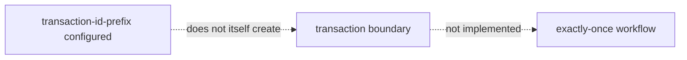

# Transaction Implementation Status

## Overview

RouteX configures `spring.kafka.producer.transaction-id-prefix`; active controller and assignment-producer code use `KafkaTemplate.send(...)` and do not call `executeInTransaction(...)`.

## Why this exists

It records the exact implementation boundary without implying exactly-once behavior.

## Problem it solves

It prevents a configuration property from being mistaken for a complete transactional workflow.

## RouteX implementation

Transaction-capable producer configuration exists in `application.yaml`; transaction execution code and consumer-to-producer transactional processing are not implemented.

## Code walkthrough

Compare the producer section of `application.yaml` with both `KafkaTemplate.send(...)` call sites.

## Execution flow

## Kafka internals

Kafka transactions require a transactional producer lifecycle and coordinator interaction; configuration alone does not make unrelated work atomic.

## Spring Boot internals

Boot can configure a transaction-capable producer factory from the prefix. The source does not show an application-managed transaction boundary.

## Observe this in RouteX

Inspect `application.yaml`, `RideRequestController.java`, and `DriverAssignmentProducer.java`; search for `executeInTransaction` and transaction manager usage.

## Production implementation

| RouteX | Production |
| --- | --- |
| Prefix configured | Transaction scope designed and tested for exact workflow |
| No transaction code | Explicit producer/consumer transaction boundaries and failure semantics |

## Trade-offs

Transactions add coordination and throughput/latency considerations; they do not automatically include databases or external notification systems.

## Common mistakes

- Equating idempotence with exactly-once business processing.
- Equating a transaction-id prefix with active transaction use.

## Best practices

Document the atomic boundary, consumers, outputs, abort behavior, and non-Kafka side-effect strategy before enabling transactions.

## Interview questions

**Does RouteX demonstrate EOS?** No; its active code does not execute a Kafka transaction.

**Follow-up:** What does a prefix prove? Transaction-capable producer configuration, not an executed workflow.

**Enterprise discussion:** Exactly-once claims must state the systems and boundary they cover.

## Quick revision

Configured transaction prefix ≠ executed transaction ≠ end-to-end exactly once.
