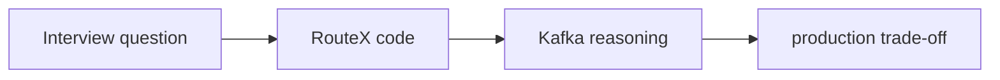

# Kafka Interviews Through RouteX

## Overview

RouteX provides code-backed interview prompts instead of disconnected definitions.

## Why this exists

Interview answers are stronger when they explain a concrete design and its limits.

## Problem it solves

It turns `ride-requested`, manual acknowledgement, retries, and DLT recovery into discussion anchors.

## RouteX implementation

The code provides producer calls, keyed records, three matching containers, manual acknowledgement, `FixedBackOff`, and an explicit DLT resolver.

## Code walkthrough

Use the class references in the topic-specific guides; do not claim features absent from source.

## Execution flow

## Kafka internals

Strong answers identify partitions, group assignment, offsets, retries, and coordinator responsibilities where relevant.

## Spring Boot internals

Relate `KafkaTemplate`, `@KafkaListener`, listener containers, `DefaultErrorHandler`, and Boot configuration to the code.

## Observe this in RouteX

Run the normal and `failure-test` paths; explain the observed partition/offset/retry logs aloud.

## Production implementation

| RouteX | Production interview extension |
| --- | --- |
| Local learning behavior | Explicit SLA, failure, security, and ownership decisions |
| Console signals | Measured lag, delivery, and operational response |

## Trade-offs

There is rarely one universal Kafka setting; discuss durability, latency, ordering, and throughput together.

## Common mistakes

- Giving definitions without a system boundary.
- Claiming RouteX implements production resilience it does not show.

## Best practices

Answer: requirement → RouteX behavior → Kafka mechanism → production alternative.

## Interview questions

| Question | Expected answer | Follow-up |
| --- | --- | --- |
| Why key by `rideId`? | To select a consistent partition for that key within a topic. | What ordering is not guaranteed? Global/cross-topic order. |
| Why separate groups? | Matching and notification need independent consumption progress. | What happens when notification stops? Its lag grows. |
| Why manual ack? | RouteX makes its success boundary explicit. | Does it guarantee EOS? No. |
| Why a DLT? | To preserve exhausted failures and unblock source progress. | Who owns replay? An operational process, not Kafka automatically. |

**Enterprise discussion:** State what RouteX lacks—security, persistence, tests, and schema governance—before proposing a production solution.

## Quick revision

Tie every answer to a RouteX class, then discuss Kafka mechanism and production trade-off.
