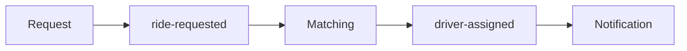

# RouteX Kafka and Spring Kafka Cheat Sheet

## Overview

This page compresses the repository's verified Kafka vocabulary.

## Why this exists

It supports fast revision after the detailed guides.

## Problem it solves

It maps concepts directly to topic names and classes.

## RouteX implementation

| Concept | RouteX anchor |
| --- | --- |
| Producer | `RideRequestController`, `DriverAssignmentProducer` |
| Topics | `KafkaTopicConfiguration` |
| Key | `rideId` |
| Matching group | `driver-matching-group`, concurrency `3` |
| Ack | `Acknowledgment.acknowledge()` |
| Retry | `FixedBackOff(2000L, 3L)` |
| DLT | `ride-requested-dlt` resolver and monitor |

## Code walkthrough

Use the anchors above to jump from definition to executable source.

## Execution flow

## Kafka internals

Topic = named partition logs; key influences partition; offset is partition position; group stores its own progress.

## Spring Boot internals

`KafkaTemplate` produces; `@KafkaListener` consumes; Boot binds Kafka properties; Spring Kafka applies container/error configuration.

## Observe this in RouteX

Use Kafka UI to locate topic partitions/groups and console logs to locate matching offsets and retry delivery.

## Production implementation

| RouteX | Production |
| --- | --- |
| JSON/local broker | Governed schemas/replicated cluster |
| Console/DLT monitor | Operational telemetry and replay process |

## Trade-offs

Partitions trade global order for parallelism; retries trade throughput for recovery; acknowledgements trade convenience for explicit control.

## Common mistakes

- Offset ≠ global event ID.
- Keyed ordering ≠ global ordering.
- DLT ≠ automatic repair.

## Best practices

Use keys for ordering units, groups for independent consumers, and idempotent handling for redelivery.

## Interview questions

**What does a group own?** Consumption progress and work sharing for its members.

**Follow-up:** What does a topic own? Stored records partitioned into logs.

**Enterprise discussion:** Each compact rule needs a workload-specific exception analysis.

## Quick revision

Key → partition; partition → order/offset; group → progress; listener → work; error handler → retry/DLT.

