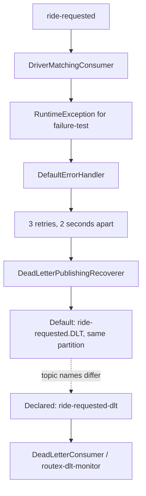

# Dead-Letter Topics and Recovery

## Declared DLT and Recovery Configuration

`KafkaTopicConfiguration` declares:

```java
public static final String RIDE_REQUESTED_DLT = "ride-requested-dlt";
```

The `rideRequestedDltTopic` bean requests 3 partitions and 1 replica. `DeadLetterConsumer` listens to that exact topic in group `routex-dlt-monitor` and receives a full `ConsumerRecord<String, RideRequestedEvent>`.

After `DefaultErrorHandler` exhausts its `FixedBackOff(2000L, 3L)`, it invokes `DeadLetterPublishingRecoverer`. However, the constructor in `KafkaErrorHandlerConfiguration` supplies only `kafkaTemplate`; it does **not** supply a destination resolver. Spring Kafka's default recoverer destination is `<original-topic>.DLT` with the original partition. Therefore a failed `ride-requested` record is recovered to:

```text
ride-requested.DLT
```

not to the declared/listened RouteX topic:

```text
ride-requested-dlt
```

This is an active configuration mismatch. The declared DLT is created and the consumer is active, but the current recoverer does not target it. Do not expect `DeadLetterConsumer` to receive the failure-test recovery until the destination configuration and listener topic agree. This documentation records the behaviour; it does not change application source.

## Failure Flow



## DLT Record Observability and Headers

If `DeadLetterConsumer` receives a record on the topic it subscribes to, it prints exactly:

```text
DLT | ride=<ride-id> | passenger=<passenger-id> | partition=<dlt-partition> | offset=<dlt-offset>
DLT HEADER | <header-name> = <value-rendered-as-string>
```

It loops over every received header rather than selecting named headers. Spring Kafka's default `DeadLetterPublishingRecoverer` adds original-record and exception metadata, including these standard header names in the Spring Kafka version used by this project:

| Header | Meaning |
| --- | --- |
| `kafka_dlt-original-topic` | Source topic name |
| `kafka_dlt-original-partition` | Source partition; binary numeric value when carried as a header |
| `kafka_dlt-original-offset` | Source offset; binary numeric value when carried as a header |
| `kafka_dlt-original-consumer-group` | Group that failed the record |
| `kafka_dlt-exception-fqcn` | Exception class |
| `kafka_dlt-exception-cause-fqcn` | Cause exception class where present |
| `kafka_dlt-exception-message` | Exception message |
| `kafka_dlt-exception-stacktrace` | Stack trace text |

The current consumer renders every header with `new String(header.value())`. Text headers such as class names/messages are readable; binary numeric header values are not safely human-readable using this rendering. The source does not decode individual header types.

## Practical Verification: Recovery and DLT Check

### Prerequisites

Start Docker Kafka and RouteX as shown in the [README](../README.md#run-locally). Keep Kafka UI open to inspect both `ride-requested.DLT` and `ride-requested-dlt` after the retry window.

### Trigger

```powershell
Invoke-RestMethod -Method Post `
    -Uri "http://localhost:8080/rides/requests" `
    -ContentType "application/json" `
    -Body '{"passengerId":"failure-test","pickupLocation":"MSRIT","destinationLocation":"Electronic City"}'
```

### Expected Output

The matching listener prints four matching lines as described in [retries and error handling](kafka-retries-and-error-handling.md). With the current source, **no `DLT | ...` or `DLT HEADER | ...` line is expected from `DeadLetterConsumer`**, because it listens to `ride-requested-dlt` while the default recoverer destination is `ride-requested.DLT`.

### What This Demonstrates

This test exposes the difference between declaring a DLT and configuring the recoverer destination. Inspect Kafka UI to distinguish the recoverer's default destination from the RouteX-declared DLT. It also prevents a misleading conclusion that the DLT consumer completed the recovery lifecycle when source topic names do not match.

## Key Takeaways

- A DLT is another Kafka topic containing records that could not be processed after retry policy is exhausted.
- `DeadLetterPublishingRecoverer` owns the recovery publish; `DeadLetterConsumer` observes records only on the topic it subscribes to.
- DLT headers retain source and exception context, but consumers should decode header bytes according to their actual type.
- The current RouteX destination mismatch must be resolved in source before its declared DLT consumer can observe default-recovered records.
