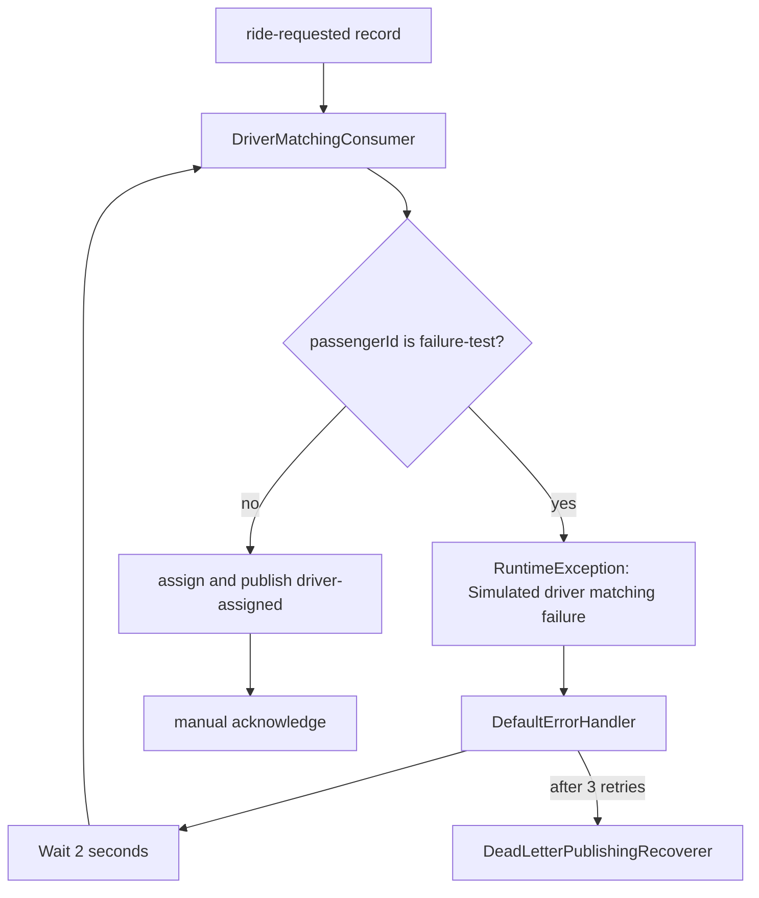

# Kafka Retries and Error Handling

## RouteX Implementation

`KafkaErrorHandlerConfiguration.kafkaErrorHandler` declares one `DefaultErrorHandler` bean. Spring Boot's Kafka listener factory configuration obtains the unique `CommonErrorHandler` bean, so this handler is used by the listeners.

```java
DeadLetterPublishingRecoverer recoverer = new DeadLetterPublishingRecoverer(kafkaTemplate);
FixedBackOff fixedBackOff = new FixedBackOff(2000L, 3L);
return new DefaultErrorHandler(recoverer, fixedBackOff);
```

`FixedBackOff(2000L, 3L)` means a 2,000 ms interval and **3 retry attempts after the initial delivery**. The failing listener can therefore be invoked up to 4 times in total before recovery is attempted.

The failure trigger is in `DriverMatchingConsumer`:

```java
if ("failure-test".equals(event.passengerId())) {
    throw new RuntimeException("Simulated driver matching failure");
}
```

It occurs before driver assignment, publishing `driver-assigned`, and manual acknowledgement. This ordering is important: the deliberate failure does not create a downstream assignment side effect before retrying.



## Practical Verification: Retry Experiment

### Prerequisites

Start Docker Kafka and RouteX as shown in the [README](../README.md#run-locally). Leave the RouteX console visible for at least six seconds after sending the request.

### Trigger

```powershell
Invoke-RestMethod -Method Post `
    -Uri "http://localhost:8080/rides/requests" `
    -ContentType "application/json" `
    -Body '{"passengerId":"failure-test","pickupLocation":"MSRIT","destinationLocation":"Electronic City"}'
```

### Expected Output

The HTTP response still contains a generated `rideId`; it is an accepted producer request, not matching success. The matching listener prints its actual line once immediately and three more times approximately two seconds apart:

```text
MATCHING | ride=<generated-uuid> | partition=<0|1|2> | offset=<dynamic-offset>
MATCHING | ride=<same-uuid> | partition=<same-partition> | offset=<same-offset>
MATCHING | ride=<same-uuid> | partition=<same-partition> | offset=<same-offset>
MATCHING | ride=<same-uuid> | partition=<same-partition> | offset=<same-offset>
```

The application code does not print retry numbers or a recovery-success line. Spring may log `Simulated driver matching failure`, but its logger format is framework-controlled. No `NOTIFICATION` output is expected because the exception is thrown before assignment publishing.

### What This Demonstrates

The first line is the initial delivery; the remaining three are the configured retries, not four retries. The repeated partition/offset identify redelivery of one source record. After the retries are exhausted, `DefaultErrorHandler` invokes its recoverer; the current recovery destination mismatch is explained in [Dead-letter topics and recovery](dead-letter-topics-and-recovery.md).

## Key Takeaways

- `DefaultErrorHandler` separates failure policy from business-listener code.
- `FixedBackOff(2000L, 3L)` means 3 retries plus the initial attempt.
- Manual acknowledgement is not an error handler; the failure path never reaches `acknowledge()`.
- Moving the simulated failure before publishing prevents this particular lab failure from duplicating `driver-assigned` records.
