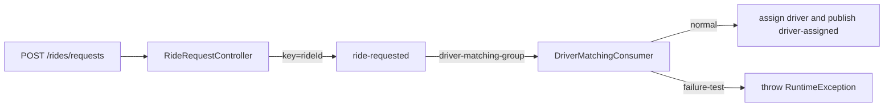

# `ride-requested` Topic

## Purpose and Contract

`ride-requested` is the entry topic for the ride workflow. `RideRequestController.requestRide` handles `POST /rides/requests`, validates `RideRequest`, generates a UUID, and sends:

```java
kafkaTemplate.send(KafkaTopicConfiguration.RIDE_REQUESTED_TOPIC, event.rideId(), event);
```

The value is `RideRequestedEvent`:

| Field | Meaning |
| --- | --- |
| `rideId` | Generated UUID and Kafka key |
| `passengerId` | HTTP request passenger identifier |
| `pickupLocation` / `destinationLocation` | Validated request locations |
| `requestedAt` | Event creation `Instant` |

The topic is declared with 3 partitions. The controller returns `202 Accepted` immediately after initiating the asynchronous send; it does not wait for broker or downstream completion.

## Consumer and Processing

`DriverMatchingConsumer.handleRideRequested` consumes in `driver-matching-group`. It logs the received `rideId`, partition, and offset. A normal record is matched, emitted as `DriverAssignmentEvent`, and manually acknowledged. The exact special value `passengerId="failure-test"` throws `RuntimeException("Simulated driver matching failure")` before driver assignment and before acknowledgement.



## Practical Verification

### Prerequisites

Start Docker Kafka and RouteX as shown in the [README](../README.md#run-locally).

### Trigger

```powershell
Invoke-RestMethod -Method Post `
    -Uri "http://localhost:8080/rides/requests" `
    -ContentType "application/json" `
    -Body '{"passengerId":"passenger-101","pickupLocation":"MSRIT","destinationLocation":"Electronic City"}'
```

### Expected Output

```text
MATCHING | ride=<generated-uuid> | partition=<0|1|2> | offset=<dynamic-offset>
```

This is followed by the notification output documented for `driver-assigned`.

### What This Demonstrates

The HTTP boundary created an immutable event, `KafkaTemplate` used its `rideId` as key, and the matching group consumed the stored record. The partition and offset are broker record metadata supplied to the listener.

## Failure Scope

The failure input is covered in [retries and error handling](kafka-retries-and-error-handling.md). It fails before the downstream assignment side effect, so no `driver-assigned` event or notification line is produced for that input.

## Key Takeaways

- `ride-requested` transports one business fact, not an HTTP call.
- `rideId` links the event to later processing and is the message key.
- A `202` response is not confirmation that matching or notification completed.
